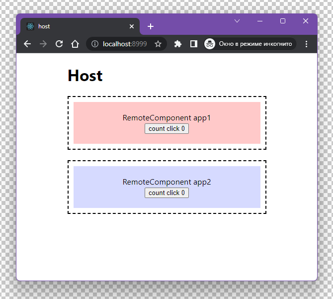

# Webpack 5 Module Federation with React/Typescript/CRACO

Host app: host

Remotes app: app1 app2

## Running Demo

### `npm start`

Runs the app in the development mode.\
Open [http://localhost:8999](http://localhost:8999) to view it in the browser.

### `npm run build`

Builds the app for production to the `build` folder.\

### `Demo`

[https://bryzgalov1.github.io/craco-module-federation/host](https://bryzgalov1.github.io/craco-module-federation/host)

### `craco.config.ts for Host`

```js
import webpack, { Configuration as WebpackConfig } from "webpack";
import { CracoConfig } from "@craco/types";
import packageJson from "./package.json";

const ModuleFederationPlugin = webpack.container.ModuleFederationPlugin;

const dependencies = packageJson.dependencies;

const cracoConfig: CracoConfig = {
    webpack: {
        configure: (webpackConfig) => {
            const production = webpackConfig.mode === "production";

            const remotes = production
                ? {
                      app1: "app1@/craco-module-federation/app1/remoteEntry.js",
                      app2: "app2@/craco-module-federation/app2/remoteEntry.js",
                  }
                : {
                      app1: "app1@http://localhost:8777/remoteEntry.js",
                      app2: "app2@http://localhost:8666/remoteEntry.js",
                  };

            const plugins = [
                ...(webpackConfig.plugins || []),
                new ModuleFederationPlugin({
                    name: "host",
                    remotes,
                    exposes: {},
                    shared: {
                        ...dependencies,
                        react: {
                            singleton: true,
                            requiredVersion: dependencies["react"],
                        },
                        "react-dom": {
                            singleton: true,
                            requiredVersion: dependencies["react-dom"],
                        },
                    },
                }),
            ];

            const publicPath = production
                ? "/craco-module-federation/host/"
                : "auto";

            const config: WebpackConfig = {
                ...webpackConfig,
                plugins,
                output: {
                    ...webpackConfig.output,
                    publicPath,
                },
            };

            return config;
        },
    },
};

export default cracoConfig;
```

### `craco.config.ts for App`

```js
import webpack, { Configuration as WebpackConfig } from "webpack";
import { CracoConfig } from "@craco/types";
import packageJson from "./package.json";

const ModuleFederationPlugin = webpack.container.ModuleFederationPlugin;

const dependencies = packageJson.dependencies;

const cracoConfig: CracoConfig = {
    webpack: {
        configure: (webpackConfig) => {
            const production = webpackConfig.mode === "production";

            const plugins = [
                ...(webpackConfig.plugins || []),
                new ModuleFederationPlugin({
                    name: "app1",
                    filename: "remoteEntry.js",
                    library: { type: "var", name: "app1" },
                    exposes: {
                        "./RemoteComponent": "./src/RemoteComponent",
                    },
                    remotes: {},
                    shared: {
                        ...dependencies,
                        react: {
                            singleton: true,
                            requiredVersion: dependencies["react"],
                        },
                        "react-dom": {
                            singleton: true,
                            requiredVersion: dependencies["react-dom"],
                        },
                    },
                }),
            ];

            const publicPath = production
                ? "/craco-module-federation/app1/"
                : "auto";

            const config: WebpackConfig = {
                ...webpackConfig,
                plugins,
                output: {
                    ...webpackConfig.output,
                    publicPath,
                },
            };

            return config;
        },
    },
};

export default cracoConfig;
```

### Screenshots



### Tech Stack

React, Typescript, CRACO, Webpack.
